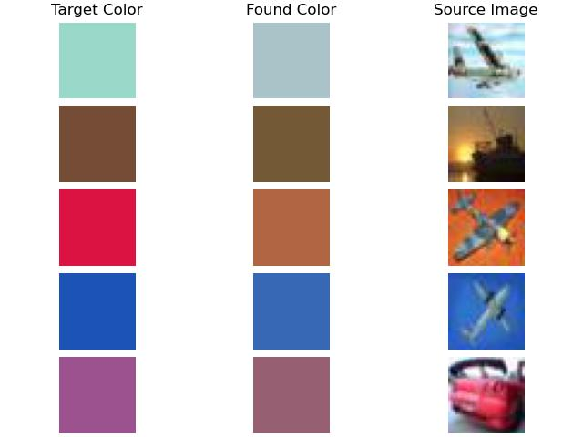
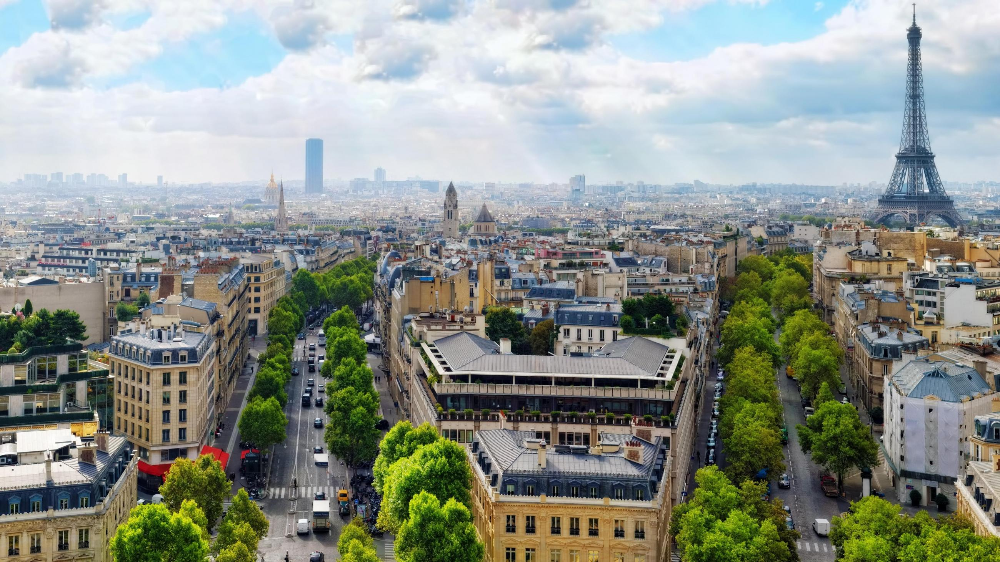
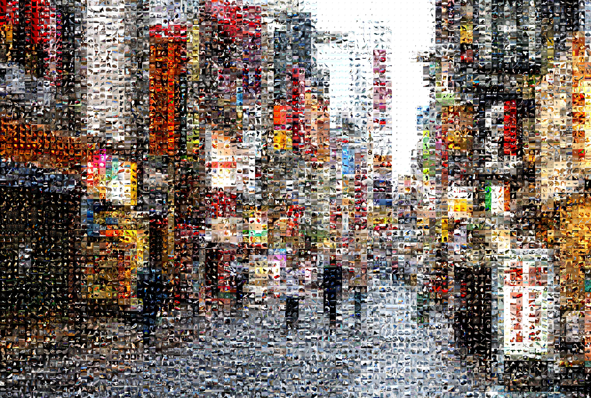
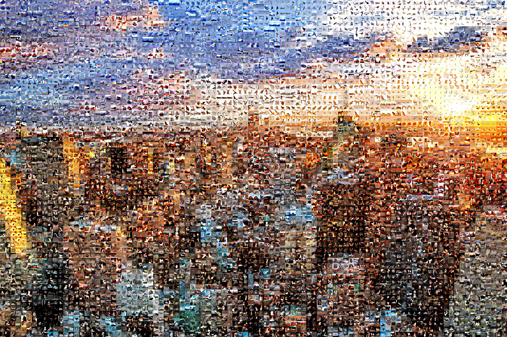

# Image Mosaic Generator

Image mosaic generator using NumPy. The algorithm takes as input a source images directory and a target image. It outputs an image resembling the target image where each pixel is replaced by its closest image in the provided source set.

To this end, the algorithm computes, for each source image, the average value of its RGB layers and compares them to the target image pixels by computing a Root Mean Square Error. For a better color variation, the source images are augmented by generating: BGR equivalents, higher contrast, grayscale and negative images. Moreover, to better handle large sizes, pooling (average and maximum) as well as strides can be used on the target image.

## Requirements

- Python 3.7
- NumPy 1.21.5
- Pillow 9.0.1

## Basic Usage

```bash
$ python main.py gen --source <path_to_image_directory> --target <path_to_image> --poolsize <pooling_size> --stride <stride_size>
```

Check out [`main.py`](https://github.com/Dastamn/image-mosaic/blob/main/main.py#L74) to see all the available options.

## Using [CIFAR-10](https://www.cs.toronto.edu/~kriz/cifar.html)

### Pixel Approximation

<section align='center'>
    
</section>

### Generated Samples

<section align='center'>
    
    
</section>

&ensp;

<section align='center'>
    
    
</section>

&ensp;

<section align='center'>
    
    
</section>
